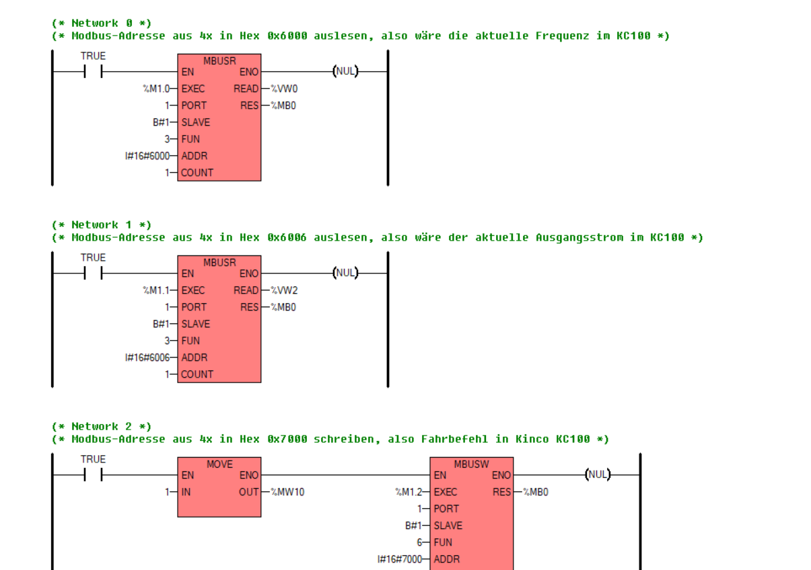
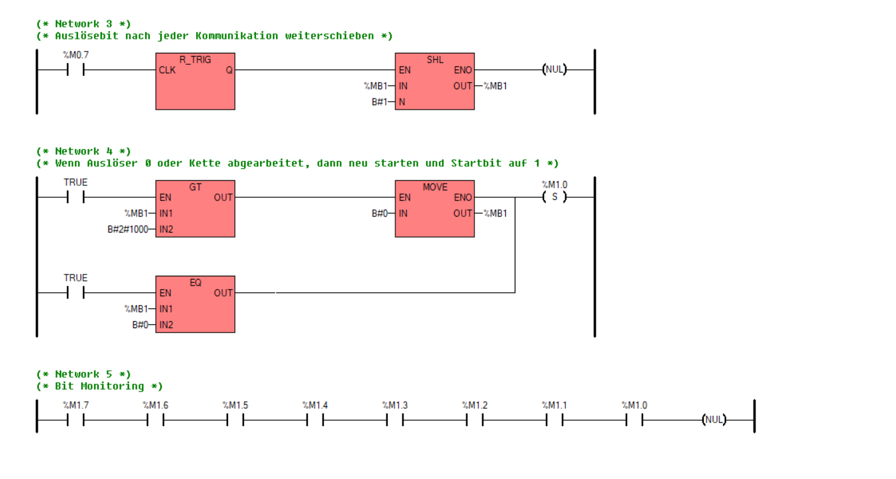

# Kinco-SPS-Modbus-Trigger

In diesem Projekt für Kinco Builder seht ihr, wie ihr einfach Modbus-Befehle in der Kinco SPS nacheinander ausführen könnt.

*Drei Modbus-Befehle werden über Auslösebits M1.0, M1.1 und M1.2 gestartet*

*Ein einfacher Bitshift-Befehl schiebt das auslösende Bit nach jeder Kommunikation um eins nach links.*
